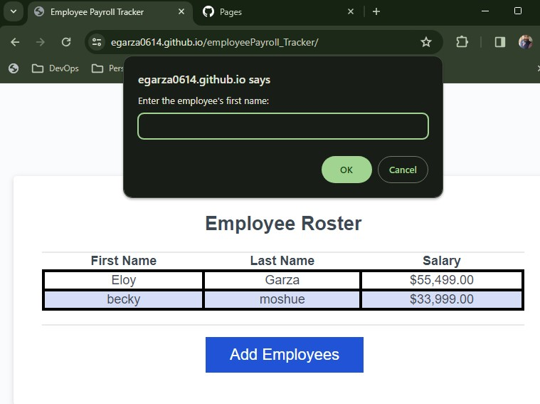

# Challeng 3: Employee Payroll Tracker

## Description
This application enables a payroll manager to view and manage employee payroll data.

## Usage

The link to my deployed github portfolio is:
https://egarza0614.github.io/employeePayroll_Tracker/

This application features dynamically updated HTML and CSS powered by JavaScript code.

When you click the "Add employee" button you are presented with a series of prompts asking for first name, last name, and salary.

When you finish adding an employee you are prompted to continue or cancel.

If you choose to continue you are prompted to add a new employee.
If you choose to cancel
your employee data is displayed on the page sorted alphabetically by last name. 

The console shows computed and aggregated data.

## Mock-Up

The following image shows the web application's appearance:

## License

[MIT © Eloy Garza](../LICENSE)